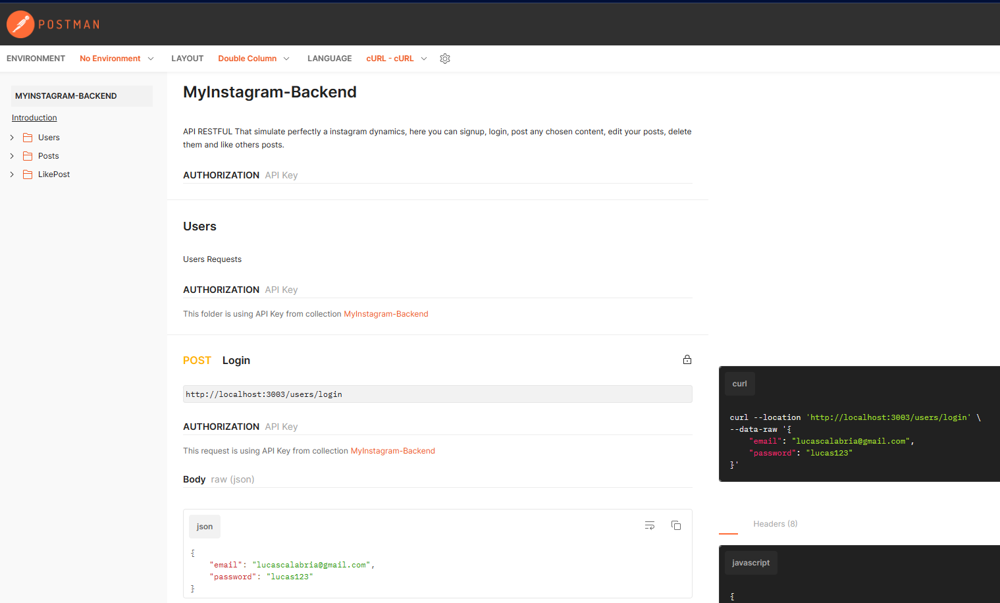

# My Instagram Back-End 

This project simulate perfectly an Instagram Application, Where trought a Restful API the user imerge on a social media app, the first requests that were created are the same that the user it's going to make, signup and login. After the person is logged it can post any type of content, such as photos, reels, storys or comments. Being in mynd that this is a Back-End APP, all of the requests are connected to the database, making it dynamic and useful.

- TypeScript
- Node.Js
- Package.JSON
- Express
- Cors
- Require and Response
- Back-End Data Flow
- Back-End Data Validation
- API creation
- Postmann
- Knex
- Git/GitHub
- OOP
- Clean Software Architecture

## Access to the API
[My-Instagram-Backend](https://documenter.getpostman.com/view/24461072/2s93RTPs84)

## 📄 Description
1. My Instagram Documentation and Layered Architecture
    - Index.ts page it's resposible for the requests itself, calling the routers and starting the process.
    - Controller Layer it's resposible for receiving the requests and return the responses checking only if the data it's coming or not.
    - Business Layer it's responsible for the business rules, in other words, it check if the data it's coming on the right shape (objects and injections).
    - Database Layer contains a raw request, it has the responsibility to connect the API with the database, receiving an order and returning the right answer.
    - Models, Interfaces and DTOS folders separate which type is going to be send to each layer, here you can find all types founded on the application, business and database ones.
    - instaDatabase.sql contains all the SQL syntax code; there you can have access to the mocked data.
    - API created and consumed using POSTMANN platform.

    ## ⚒️ Technologies

